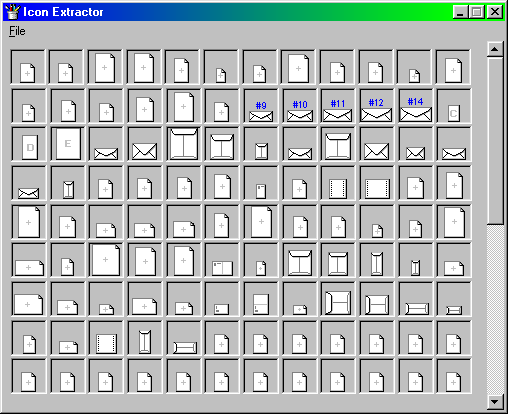



## EZ Icon Extractor

### Description

This program lists all the icons in an icon libary (DLLs, EXEs, GIFs, JPGs, BMPs). Double-click an icon to save it.
 
### More Info
 

             |
---                |---
**Submitted On**   |2001-04-27 21:38:56
**By**             |[Sean Ferguson](https://github.com/Planet-Source-Code/PSCIndex/blob/master/ByAuthor/sean-ferguson.md)
**Level**          |Intermediate
**User Rating**    |5.0 (20 globes from 4 users)
**Compatibility**  |VB 6\.0
**Category**       |[Graphics](https://github.com/Planet-Source-Code/PSCIndex/blob/master/ByCategory/graphics__1-46.md)
**World**          |[Visual Basic](https://github.com/Planet-Source-Code/PSCIndex/blob/master/ByWorld/visual-basic.md)
**Archive File**   |[EZ Icon Ex189114272001\.zip](https://github.com/Planet-Source-Code/sean-ferguson-ez-icon-extractor__1-22763/archive/master.zip)

